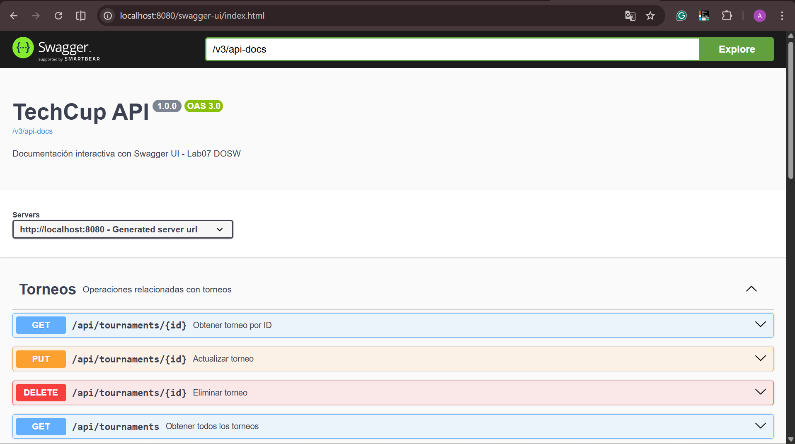
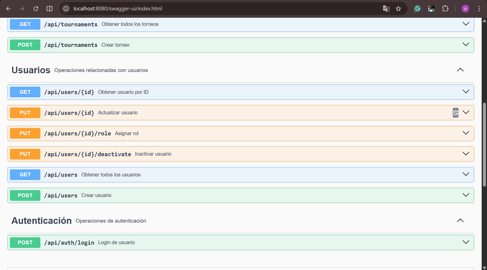
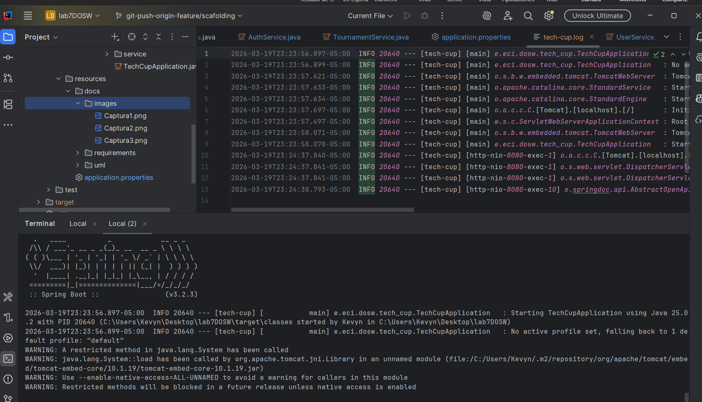
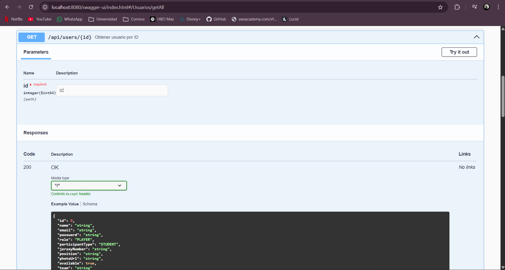
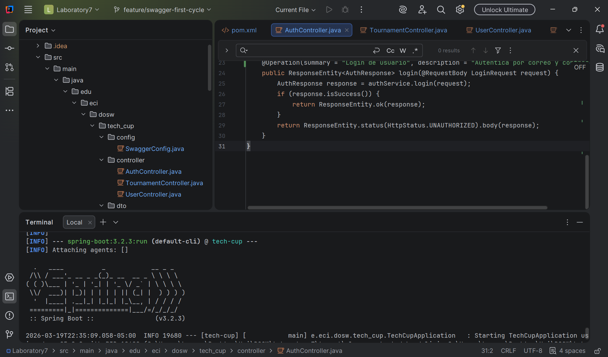

# TechCup-Lab07-Kevyn-Diego-Juliana-Juan


## Descripción
API REST para la gestión del torneo TechCup, desarrollada con Spring Boot.
Equipo: Kevyn Daniel Forero, Diego Alejandro Montes, Maria Juliana Rodríguez, Juan Angel Salas.

## Laboratorio 6 - TDD y Diseño

### Objetivo
Aplicar TDD como fundamento de estructuración técnica del proyecto de software.

### Diagrama de Clases
El proyecto cuenta con las siguientes clases principales:
- **User**: Representa a un usuario del sistema con rol, correo y contraseña.
- **Tournament**: Representa un torneo con estados: DRAFT, ACTIVE, IN_PROGRESS, FINISHED.
- **Team**: Equipo de jugadores dentro de un torneo.
- **Match**: Partido entre dos equipos dentro de un torneo.
- **Payment**: Pago asociado a un equipo para participar en un torneo.

### Pruebas TDD implementadas
Se implementaron pruebas unitarias para los siguientes casos:

**Usuarios:**
- Registro de usuario con rol por defecto PLAYER.
- Autenticación con credenciales válidas e inválidas.

**Torneos:**
- Creación de torneo en estado DRAFT por defecto.
- No modificar torneo en estado FINISHED.
- Eliminar torneo solo en estado DRAFT.

## Preguntas - Spring Boot

### 1. ¿Para qué sirve el paquete Controller?
Es la capa que recibe las peticiones HTTP del cliente. Contiene las clases anotadas con `@RestController` que definen los endpoints de la API y devuelven las respuestas al cliente.

### 2. ¿Para qué sirve el paquete Service?
Contiene la lógica de negocio de la aplicación. Las clases se anotan con `@Service` y son llamadas por los controllers. Aquí se aplican las reglas del negocio antes de acceder a los datos.

### 3. ¿Para qué sirve el paquete Repository?
Es la capa de acceso a datos. Contiene las interfaces que se comunican con la base de datos usando JPA. Las clases se anotan con `@Repository`.

### 4. ¿Para qué sirve el paquete Controller?
Pregunta repetida, contestada en la pregunta1

### 5. ¿Para qué sirve el paquete Entity?
Contiene las clases que representan las tablas de la base de datos. Se anotan con `@Entity` y son usadas por JPA para mapear los datos entre Java y la base de datos.

### 6. ¿Para qué sirve el paquete DTO?
DTO significa Data Transfer Object. Contiene clases que se usan para transferir datos entre capas de la aplicación, evitando exponer directamente las entidades del modelo.

### 7. ¿Para qué sirve el paquete Exception?
Contiene las clases para el manejo de errores y excepciones personalizadas. Se usan con `@ControllerAdvice` para centralizar el manejo de errores de la API.

## Bibliografía

Spring Framework. (2024). *Spring Boot Reference Documentation*. https://docs.spring.io/spring-boot/docs/current/reference/html/

Baeldung. (2024). *REST with Spring Tutorial*. https://www.baeldung.com/rest-with-spring-series

VMware. (2024). *Building a RESTful Web Service*. https://spring.io/guides/gs/rest-service/

## Parte 2 - Diagrama de clases a implementación

### Clases identificadas para el primer ciclo
Se identificaron las siguientes clases para cubrir los requerimientos de Autenticación, Usuarios (CRUD) y Torneo (CRUD):

**Autenticación:**
- `AuthController` - Endpoint POST /api/auth/login
- `AuthService` - Lógica de autenticación por correo y contraseña
- `LoginRequest` - DTO con correo y contraseña
- `AuthResponse` - DTO con resultado del login

**Usuarios:**
- `UserController` - Endpoints CRUD de usuarios
- `UserService` - Lógica de negocio de usuarios
- `User` - Modelo de usuario

**Torneo:**
- `TournamentController` - Endpoints CRUD de torneos
- `TournamentService` - Lógica de negocio de torneos
- `Tournament` - Modelo de torneo

### Pruebas TDD
Se crearon pruebas unitarias para los 3 requerimientos:
- `AuthServiceTest` - Pruebas de autenticación
- `UserServiceTest` - Pruebas de usuarios
- `TournamentServiceTest` - Pruebas de torneos

## Parte 3 - API primer ciclo

### Endpoints implementados

**Autenticación:**
- `POST /api/auth/login` - Autentica por correo y contraseña

**Usuarios:**
- `GET /api/users` - Obtener todos los usuarios
- `GET /api/users/{id}` - Obtener usuario por ID
- `POST /api/users` - Crear usuario (rol PLAYER por defecto)
- `PUT /api/users/{id}` - Actualizar usuario
- `PUT /api/users/{id}/role` - Asignar rol (solo ADMIN)
- `PUT /api/users/{id}/deactivate` - Inactivar usuario

**Torneos:**
- `GET /api/tournaments` - Obtener todos los torneos
- `GET /api/tournaments/{id}` - Obtener torneo por ID
- `POST /api/tournaments` - Crear torneo (estado DRAFT por defecto)
- `PUT /api/tournaments/{id}` - Actualizar torneo (no aplica si está FINISHED)
- `DELETE /api/tournaments/{id}` - Eliminar torneo (solo si está en DRAFT)

## Parte 4 - Swagger

### Documentación de la API
La API fue documentada usando Swagger UI con SpringDoc OpenAPI. Se agregó la dependencia `springdoc-openapi-starter-webmvc-ui` y se configuró la clase `SwaggerConfig` para personalizar el título y versión. Cada controlador fue anotado con `@Tag` y `@Operation` para describir los endpoints.

Para acceder a la documentación: `http://localhost:8080/swagger-ui.html`





## Parte 5 - Logger

### Registro de acciones con SLF4J
Se implementó el registro de acciones y errores en los servicios usando SLF4J. Se agregaron logs de tipo `debug`, `info` y `warn` en los métodos de `AuthService`, `UserService` y `TournamentService`.

El archivo de logs se configura en `application.properties`:
```properties
logging.file.name=logs/tech-cup.log
```



